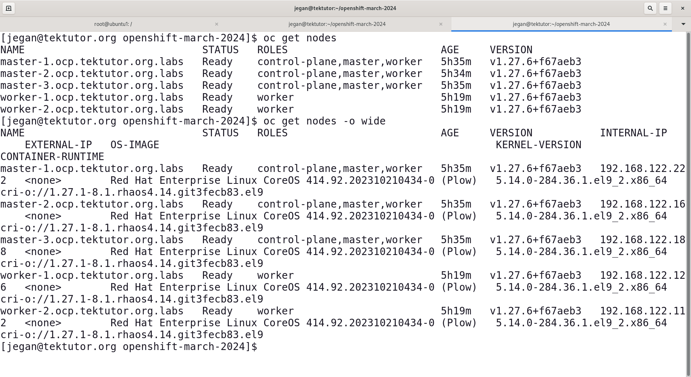
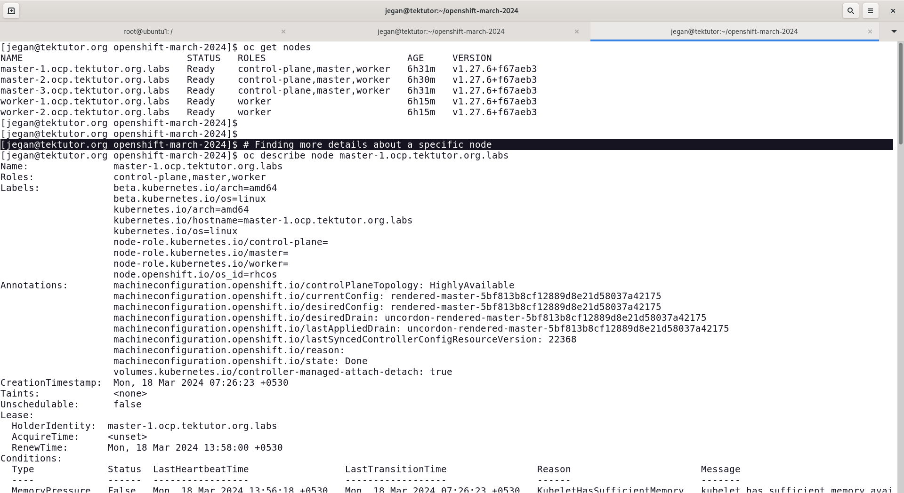

# Day 1

## Docker Overview
- comes in 2 flavors
  - Community Edition - Docker CE
  - Enterpise Edition - Docker EE
- written in Go language
- Developed and maintained by an organization called Docker Inc
- Client/Server architecture
- Client tool - docker
- Server tool - runs a service in Linux/Windows/Mac
- Registries
  - this is where all docker images are cached
- Docker Image
  - is a blueprint of Docker container
  - 
- docker container
  - it is an application process that runs in a separate unix namespace
  - though it looks like a virtual machine or a OS, it is technically just an application process
  - containers gets its own network stack, it own file system
  - containers also support package manager ( apt, yum, rpm, linux tools )
  - containers will never be able to replace an Operating System or Virtual machines
  - containers don't have their own OS Kernel
  - container represent a single application
  - containers running on the same system/os shares the Hardwares resources available on the OS they are running
  - containers will depend on the OS Kernel on which they are running

## Linux Kernel Container Features
- Namespace
  - allows to isolate one container from rest of the other containers
- Control Groups (CGroups)
  - let's you apply some resource quota restricts like
    - restrict how many cpu cores a particular container can utilize
    - restrict how much RAM a particular container at the max can utilize
    - restric how much storage a particular container at the max can utilize

## What is a Container Engine?
- a high-level software that depends on Container Runtime to manage container images and containers
- it offers user-friendly commands to manage images and containers but it depends on Container Runtimes to do that under the hood
- examples
  - Docker depends on containerd which internally uses runC container Runtime
  - Podman depends on CRI-O Container Runtime to manage images and containers

## What is a Container Runtime?
- low-level software that know how to manage container images and containers
- it is not so user-friendly, hence normally end-users like us wouldn't use container runtime directly
- end-user will be using Container Engine not the Container runtime
- Exmaples
  - runC
  - CRI-O
  - rkt (pronounced as Rocket)

## What is Container Orchestration Platform?
- manages the containerized application workloads
- has one or more servers ( cluster )
- most popular features that are supported by any Container Orchestration Platform
  - high availability to your applications that runs with Container Orchestration Platforms
  - it also supports in-built load-balancing, monitoring features to heal/repair your non-responding applications, etc.,
  - it also supports scaling up/down ( increase/reduce the no of application instances - depending on user traffic )
  - rolling update
    - you can upgrade/downgrade your already alive application from one version to other without any downtime
    - rolling back to older version of an application is also possible
- Examples
  - Docker SWARM
  - Kubernetes
  - Red Hat OpenShift
 
## What is Docker SWARM?
- it is an Orchestration platfrom from Docker Inc organization
- it is open-source
- it is not production-grade
- it is very light-weight setup, you could install this easily on a normal laptop/desktop
- generally used for learning purpose, Dev/QA setup
- never seen this in production
- it only supports managing Docker containerized applications

## What is Kubernetes?
- it is an Orchestration platfrom from Google
- it is open-source
- it is production-grade
- it can be used in Dev/QA/Production pretty much everyone
- as it is open-source we don't get any official support
- AWS offers managed EKS - Elastic Kubernetes Service, you can get support from Amazon
- Azure offers managed AKS - Azure Kubernetes Service, you can get support from Microsoft
- Kuberetes supports Operators and Custom Resource Definitions to extend the functionality of Kubernetes
- this is CLI only, no webconsole
- Kubernetes supports deploying applications only as Container Images not from source code directly

## What is OpenShift?
- it is an Orchestration platfrom from Red Hat
- it is Red Hat's distribution of Kubernetes
- Openshift is developed on top of opensource Google Kubernetes with many additional features
- OpenShift using Kubernetes Operators( ie Custom Resources and Customer Operators ) has added many additional features on top of Kubernetes
- You will get support from Red Hat
- It is a licensed product
- it is a superset of Google Kubernetes
- This supports Command-line and Web-console
- Openshift also support CI/CD
- OpenShift is capable of building an application from source code and deploy that as containized workloads within OpenShift
- nodes can be a physical server with either RedHat Enterprise Linux installed on RedHat Enterprise Linux Core OS

- supports two types of nodes
  - master nodes
    - this is where Control plane components will be running
    - normally no user-applications will run in these types of nodes, but we can configure the master node to run user-applications if required
    - Control Plane
      - API Server
      - etcd data store
      - scheduler
      - controller managers ( this is collection of many controllers )
   - control planes only runs in master node
  - worker nodes
    - this is where normally the user application instances will be running

## What is an OpenShift Node?
- can be physical server, virtual machine with RedHat Enterprise Linux or RedHat Enterprise Linux Core OS
- can be aws ec2 instance, azure virtual machine
- it is a virtual machine in public/private/hybrid cloude
- it is a on-prem server
- master nodes are allowed to have only Red Hat Enterprise Linux Core OS (RHCOS)
- worker nodes are allowed to choose between
  - Red Hat Enterprise Linux (RHEL)
  - Red Hat Enterprise Linux Core OS (RHCOS)

# Control Plane components
## API Server
- this is a Pod that runs in all the master nodes
- API Servers supports REST APIs for every OpenShift functionality
- OpenShift client tools like oc or kubectl will be interacting with API Server to get things done
- All the other components within OpenShift are allocated to interact only with API Server
- API Server is the only component that interacts or uses etcd data store 

## etcd 
- this is key-value data store
- opensource database, which can be used in normal applications that runs within Kubernetes/Openshift or outside them
- this is where OpenShift stores cluster details, application deployed, pretty much every data about the openshift cluster and application status are stored here
- each time a new record is created, or an existing record is updated/deleted, API Server will notify via an event
  
## Scheduler
- is the component which is responsible to identify an healthy node to run new application instances
- the schedulation recommendation it sends to API Servers via a REST call

## Controller Managers
- it is a collection of many controllers
- there are multiple controllers in Kubernetes/OpenShift
- Controllers are the one which supports monitoring featurew within Kuberenetes/OpenShift
- Examples
  - Deployment Controller that manages Deployment resource
  - ReplicaSet Controller that manages ReplicaSet resource
  - DaemonSet Controller that manages DaemonSet
  - StatefulSet Controller that manages StatefulSet

## Info - Worker Nodes
- this is where user applications run

## Info - Common components that runs on both master and worker nodes
- kube-proxy
  - this is the one which support load-balancing

- kubelet
  - this is a container agent components that interacts with CRI-O Container Runtime
  - responsible for creating new application pods and reporting their status to master nodes
  - monitors health of application pods running on the local node and repairing them if required

- coredns
  - DNS - Domain naming server
  - In office network, you will have a DNS server that resolve all your machine hostname to their corresponding IP address
  - this runs in every node (master and worker )
  - this helps in Service discovery
    i.e resolving the Ip address of a service by its name

## Info - OpenShift client tools
- oc
- kubectl

## Info - maxiumum pods that can run in a single node
- https://kubernetes.io/docs/setup/best-practices/cluster-large/#:~:text=More%20specifically%2C%20Kubernetes%20is%20designed,more%20than%20150%2C000%20total%20pods
- 110 pods can run in a single node

## Info - Commonly used Openshift Resources

- Pod
  - is a collection of related containers
  - In OpenShift/Kubernetes IP address is assigned on the Pod level not on the container level
  - each Pod represents one application instance
 
- ReplicaSet
  - this tells how many instances of a Pod is supposed to be running at any point of time
  - Desired count of Pods
  - Actual count of Pods
  - How many Pods are in ready state
  - How many running but not ready
  - is a configuration object (JSON/YAML) record stored in etcd data base
  - this resource is managed by ReplicaSet Controller
  - supports scale up/down ( ie adding more instances or your application or removing unwanted pod instances )

- Deployment
  - this tells what is the name of our application
  - represents the application
  - what is Container Image that must be used to deploy the Pods
  - How many instance of the Pods are supposed to created
  - is a configuration object (JSON/YAML) record stored in etcd data base
  - this resource is managed by Deployment Controller
  - supports rolling update

Whenever we deploy an application within Kubernetes/OpenShift, a Deployment, ReplicaSet and Pods are automatically created.

## Info - About our Openshift Lab setup
- Production grade
- System Configuration
  - 48 virtual cores
  - 755 GB RAM
  - 17 TB HDD Storage
- CentOS 7.9.2009 64-bit OS
- KVM Hypervisor
- 7 Virtual machines
  - Master 1 with RHEL Core OS ( 8 Cores, 128GB RAM, 500 GB HDD )
  - Master 2 with RHEL Core OS ( 8 Cores, 128GB RAM, 500 GB HDD )
  - Master 3 with RHEL Core OS ( 8 Cores, 128GB RAM, 500 GB HDD )
  - Worker 1 with RHEL Core OS ( 8 Cores, 128GB RAM, 500 GB HDD )
  - Worker 2 with RHEL Core OS ( 8 Cores, 128GB RAM, 500 GB HDD )
  - HAProxy Load Balancer Virtual Machine
  - One more VM created/destroyed during Openshift installation (BootStrap Virtual Machine)
- OS1 ( 10.10.15.107 ) - Openshift cluster 1 ( 9 participants - user01 thru user09 )
- OS2 ( 10.10.15.106 ) - Openshift cluster 2 ( 8 participants - user10 thru user17 )
- OS3 ( 10.10.15.105 ) - openshift cluster 3 ( 8 participants - user18 thru user25 )

## Red Hat Openshift
- can be installed in On-Prem servers
- can be installed manually in public clouds (AWS, Azure, GCP, Digital Ocean, etc)
- AWS managed services ( ROSA - Red Hat OpenShift )
- Azure managed service ( ARO - Azure Red Hat OpenShift )

## About Red Hat Core OS (RHCOS)
- is an optimized enterprise grade operating system used in Orchestration Platforms like Red Hat OpenShift
- it uses a boot configuration file called ignition file
- the ignition files have to be kept in a load balancer that the RHCOS machine can access
- only thru the remote ignition files the RHCOS can be booted

## Imperative vs Declarative
- Openshift supports both imperative and declarative style to manage applications
- imperative style involves just commands to deploy,undeploy, scale up/down, rolling update etc
- declarative styles requires writing manifest files(yaml/json) files, ie converting everything into source code which can be pushed to version control like GitHub, BitBucket, GitLab, etc.,
- Declarative style is recommended over the imperative style

## Lab - Listing all nodes in the OpenShift cluster
```
oc get nodes
oc get nodes -o wide
```

Expected output


## Lab - Finding more details about a node
```
oc get nodes
oc describe node master-1.ocp.tektutor.org.labs
```
Expected output


## Lab - Finding more details about Openshift private image registry
```
oc describe svc/image-registry -n openshift-image-registry
```

Expected output
<pre>
[jegan@tektutor.org openshift-march-2024]$ oc describe svc/image-registry -n openshift-image-registry
Name:              image-registry
Namespace:         openshift-image-registry
Labels:            docker-registry=default
Annotations:       imageregistry.operator.openshift.io/checksum: sha256:1c19715a76014ae1d56140d6390a08f14f453c1a59dc36c15718f40c638ef63d
                   service.alpha.openshift.io/serving-cert-secret-name: image-registry-tls
                   service.alpha.openshift.io/serving-cert-signed-by: openshift-service-serving-signer@1710727234
                   service.beta.openshift.io/serving-cert-signed-by: openshift-service-serving-signer@1710727234
Selector:          docker-registry=default
Type:              ClusterIP
IP Family Policy:  SingleStack
IP Families:       IPv4
IP:                172.30.193.120
IPs:               172.30.193.120
Port:              5000-tcp  5000/TCP
TargetPort:        5000/TCP
Endpoints:         10.128.0.38:5000
Session Affinity:  None
Events:            <none>  
</pre>

## Lab - Create an openshift project

In the below command, replace 'jegan' with your name.
```
oc new-project jegan
```

Expected output
<pre>
[jegan@tektutor.org openshift-march-2024]$ oc new-project jegan
Now using project "jegan" on server "https://api.ocp.tektutor.org.labs:6443".

You can add applications to this project with the 'new-app' command. For example, try:

    oc new-app rails-postgresql-example

to build a new example application in Ruby. Or use kubectl to deploy a simple Kubernetes application:

    kubectl create deployment hello-node --image=registry.k8s.io/e2e-test-images/agnhost:2.43 -- /agnhost serve-hostname  
</pre>


## Lab - Checking the currently active project in CLI
```
oc project
```

Expected output
<pre>
[jegan@tektutor.org openshift-march-2024]$ oc project
Using project "jegan" on server "https://api.ocp.tektutor.org.labs:6443".  
</pre>


## Lab - Listing all project in the Openshift cluster
```
oc get projects
```

Expected output
<pre>
[jegan@tektutor.org openshift-march-2024]$ oc get projects
NAME                                               DISPLAY NAME   STATUS
default                                                           Active
jegan                                                             Active
kube-node-lease                                                   Active
kube-public                                                       Active
kube-system                                                       Active
openshift                                                         Active
openshift-apiserver                                               Active
openshift-apiserver-operator                                      Active
openshift-authentication                                          Active
openshift-authentication-operator                                 Active
openshift-cloud-controller-manager                                Active
openshift-cloud-controller-manager-operator                       Active
openshift-cloud-credential-operator                               Active
openshift-cloud-network-config-controller                         Active
openshift-cluster-csi-drivers                                     Active
openshift-cluster-machine-approver                                Active
openshift-cluster-node-tuning-operator                            Active
openshift-cluster-samples-operator                                Active
openshift-cluster-storage-operator                                Active
openshift-cluster-version                                         Active
openshift-config                                                  Active
openshift-config-managed                                          Active
openshift-config-operator                                         Active
openshift-console                                                 Active
openshift-console-operator                                        Active
openshift-console-user-settings                                   Active
openshift-controller-manager                                      Active
openshift-controller-manager-operator                             Active
openshift-dns                                                     Active
openshift-dns-operator                                            Active
openshift-etcd                                                    Active
openshift-etcd-operator                                           Active
openshift-host-network                                            Active
openshift-image-registry                                          Active
openshift-infra                                                   Active
openshift-ingress                                                 Active
openshift-ingress-canary                                          Active
openshift-ingress-operator                                        Active
openshift-insights                                                Active
openshift-kni-infra                                               Active
openshift-kube-apiserver                                          Active
openshift-kube-apiserver-operator                                 Active
openshift-kube-controller-manager                                 Active
openshift-kube-controller-manager-operator                        Active
openshift-kube-scheduler                                          Active
openshift-kube-scheduler-operator                                 Active
openshift-kube-storage-version-migrator                           Active
openshift-kube-storage-version-migrator-operator                  Active
openshift-machine-api                                             Active
openshift-machine-config-operator                                 Active
openshift-marketplace                                             Active
openshift-monitoring                                              Active
openshift-multus                                                  Active
openshift-network-diagnostics                                     Active
openshift-network-node-identity                                   Active
openshift-network-operator                                        Active
openshift-node                                                    Active
openshift-nutanix-infra                                           Active
openshift-oauth-apiserver                                         Active
openshift-openstack-infra                                         Active
openshift-operator-lifecycle-manager                              Active
openshift-operators                                               Active
openshift-ovirt-infra                                             Active
openshift-route-controller-manager                                Active
openshift-sdn                                                     Active
openshift-service-ca                                              Active
openshift-service-ca-operator                                     Active
openshift-user-workload-monitoring                                Active
openshift-vsphere-infra                                           Active  
</pre>

## Lab - Switching to a specific project
```
oc project jegan
oc project default
```

Expected output
<pre>
[jegan@tektutor.org openshift-march-2024]$ oc project jegan
Now using project "jegan" on server "https://api.ocp.tektutor.org.labs:6443".
  
[jegan@tektutor.org openshift-march-2024]$ oc project default
Now using project "default" on server "https://api.ocp.tektutor.org.labs:6443".  
</pre>

## Lab - Creating your first deployment in Openshift
```
oc create deployment nginx --image=nginx:latest
```

Expected ouptut
<pre>
[jegan@tektutor.org openshift-march-2024]$ oc create deployment nginx --image=nginx:latest 
deployment.apps/nginx created 
</pre>

Listing the deployments
```
oc get deployments
oc get deployment
oc get deploy
```

Expected output
<pre>
[jegan@tektutor.org openshift-march-2024]$ oc get deployments
NAME    READY   UP-TO-DATE   AVAILABLE   AGE
nginx   0/1     1            0           81s
  
[jegan@tektutor.org openshift-march-2024]$ oc get deployment
NAME    READY   UP-TO-DATE   AVAILABLE   AGE
nginx   0/1     1            0           2m34s
  
[jegan@tektutor.org openshift-march-2024]$ oc get deploy
NAME    READY   UP-TO-DATE   AVAILABLE   AGE
nginx   0/1     1            0           2m37s  
</pre>

Listing the replicasets
```
oc get replicasets
oc get replicaset
oc get rs
```

Expected output
<pre>
[jegan@tektutor.org openshift-march-2024]$ oc get replicasets
NAME               DESIRED   CURRENT   READY   AGE
nginx-7bf8c77b5b   1         1         0       10m
  
[jegan@tektutor.org openshift-march-2024]$ oc get replicaset
NAME               DESIRED   CURRENT   READY   AGE
nginx-7bf8c77b5b   1         1         0       10m
  
[jegan@tektutor.org openshift-march-2024]$ oc get rs
NAME               DESIRED   CURRENT   READY   AGE
nginx-7bf8c77b5b   1         1         0       10m  
</pre>

Listing the pods
```
oc get pods
oc get pod
oc get po
```

Expected output
<pre>
[jegan@tektutor.org openshift-march-2024]$ oc get pods
NAME                     READY   STATUS             RESTARTS      AGE
nginx-7bf8c77b5b-mmvqf   0/1     CrashLoopBackOff   7 (61s ago)   12m
  
[jegan@tektutor.org openshift-march-2024]$ oc get pod
NAME                     READY   STATUS             RESTARTS      AGE
nginx-7bf8c77b5b-mmvqf   0/1     CrashLoopBackOff   7 (64s ago)   12m
  
[jegan@tektutor.org openshift-march-2024]$ oc get po
NAME                     READY   STATUS             RESTARTS      AGE
nginx-7bf8c77b5b-mmvqf   0/1     CrashLoopBackOff   7 (66s ago)   12m  
</pre>

Debugging the Pod crash
```
oc logs nginx-7bf8c77b5b-mmvqf
```

Expected output
<pre>
[jegan@tektutor.org openshift-march-2024]$ oc logs nginx-7bf8c77b5b-mmvqf
/docker-entrypoint.sh: /docker-entrypoint.d/ is not empty, will attempt to perform configuration
/docker-entrypoint.sh: Looking for shell scripts in /docker-entrypoint.d/
/docker-entrypoint.sh: Launching /docker-entrypoint.d/10-listen-on-ipv6-by-default.sh
10-listen-on-ipv6-by-default.sh: info: can not modify /etc/nginx/conf.d/default.conf (read-only file system?)
/docker-entrypoint.sh: Sourcing /docker-entrypoint.d/15-local-resolvers.envsh
/docker-entrypoint.sh: Launching /docker-entrypoint.d/20-envsubst-on-templates.sh
/docker-entrypoint.sh: Launching /docker-entrypoint.d/30-tune-worker-processes.sh
/docker-entrypoint.sh: Configuration complete; ready for start up
2024/03/18 09:49:19 [warn] 1#1: the "user" directive makes sense only if the master process runs with super-user privileges, ignored in /etc/nginx/nginx.conf:2
nginx: [warn] the "user" directive makes sense only if the master process runs with super-user privileges, ignored in /etc/nginx/nginx.conf:2
2024/03/18 09:49:19 [emerg] 1#1: mkdir() "/var/cache/nginx/client_temp" failed (13: Permission denied)
nginx: [emerg] mkdir() "/var/cache/nginx/client_temp" failed (13: Permission denied)  
</pre>

### Points to remember
- Red Hat Openshift uses RedHat Enterprise Linux Core OS
- RHCOS has many restrictions or insists best practises
- RHEL Core OS reserves ports under 1024 for its internal use
- Many folders within the OS is made as ready only
- Any application Pod attempts to perform write operation on those restricted folders will not be allowed to run
- For detailed documentation, please refer official documentation here https://docs.openshift.com/container-platform/4.8/architecture/architecture-rhcos.html

## Lab - Listing all the resources in your project
```
oc project
oc get deploy,rs,po
oc get all
```

Expected output
<pre>
[jegan@tektutor.org openshift-march-2024]$ oc project
Using project "jegan" on server "https://api.ocp.tektutor.org.labs:6443".
[jegan@tektutor.org openshift-march-2024]$ oc get deploy,rs,po
NAME                    READY   UP-TO-DATE   AVAILABLE   AGE
deployment.apps/nginx   0/1     1            0           35m

NAME                               DESIRED   CURRENT   READY   AGE
replicaset.apps/nginx-7bf8c77b5b   1         1         0       35m

NAME                         READY   STATUS             RESTARTS         AGE
pod/nginx-7bf8c77b5b-mmvqf   0/1     CrashLoopBackOff   11 (4m12s ago)   35m
  
[jegan@tektutor.org openshift-march-2024]$ oc get all
Warning: apps.openshift.io/v1 DeploymentConfig is deprecated in v4.14+, unavailable in v4.10000+
NAME                         READY   STATUS             RESTARTS         AGE
pod/nginx-7bf8c77b5b-mmvqf   0/1     CrashLoopBackOff   11 (4m28s ago)   36m

NAME                    READY   UP-TO-DATE   AVAILABLE   AGE
deployment.apps/nginx   0/1     1            0           36m

NAME                               DESIRED   CURRENT   READY   AGE
replicaset.apps/nginx-7bf8c77b5b   1         1         0       36m  
</pre>

## Lab - Deleting the nginx deployment

When we delete a deployment, deployment is the parent object.  Automatically, deployment will delete the replicaset as part of the deployment delete procedure.  The replicaset will automatically delete all the Pods under that.  Hence, when we delete a deployment, it will delete deployment, replicaset and all the pods in the deployment.

```
oc delete deploy/nginx
oc get deploy,rs,po
oc get all
```

Expected output
<pre>
[jegan@tektutor.org openshift-march-2024]$ oc delete deploy/nginx
deployment.apps "nginx" deleted
  
[jegan@tektutor.org openshift-march-2024]$ oc get deploy,rs,po
No resources found in jegan namespace.

[jegan@tektutor.org openshift-march-2024]$ oc get all
Warning: apps.openshift.io/v1 DeploymentConfig is deprecated in v4.14+, unavailable in v4.10000+
No resources found in jegan namespace.  
</pre>

## Lab - Deploying nginx using bitnami/nginx
```
oc create deploy nginx --image=bitnami/nginx:latest --replicas=3
oc get deploy,rs,po
oc get po -w
```

Expected output ( to come out of the oc get po -w watch mode, press Ctrl + C )
<pre>
[jegan@tektutor.org openshift-march-2024]$ oc create deploy nginx --image=bitnami/nginx:latest --replicas=3
deployment.apps/nginx created
[jegan@tektutor.org openshift-march-2024]$ oc get deploy,rs,po
NAME                    READY   UP-TO-DATE   AVAILABLE   AGE
deployment.apps/nginx   0/3     3            0           6s

NAME                              DESIRED   CURRENT   READY   AGE
replicaset.apps/nginx-bb865dc5f   3         3         0       6s

NAME                        READY   STATUS              RESTARTS   AGE
pod/nginx-bb865dc5f-225lb   0/1     ContainerCreating   0          6s
pod/nginx-bb865dc5f-hm8tl   0/1     ContainerCreating   0          6s
pod/nginx-bb865dc5f-q5xkf   0/1     ContainerCreating   0          6s
[jegan@tektutor.org openshift-march-2024]$ oc get po -w
NAME                    READY   STATUS              RESTARTS   AGE
nginx-bb865dc5f-225lb   0/1     ContainerCreating   0          11s
nginx-bb865dc5f-hm8tl   0/1     ContainerCreating   0          11s
nginx-bb865dc5f-q5xkf   0/1     ContainerCreating   0          11s
nginx-bb865dc5f-225lb   1/1     Running             0          14s
nginx-bb865dc5f-hm8tl   1/1     Running             0          16s
nginx-bb865dc5f-q5xkf   1/1     Running             0          17s
^C[jegan@tektutor.org openshift-march-2024]$   
</pre>

## Lab - Finding IP address of a Pod and figure out which pod is running on which node
```
oc get po
oc get po -o wide
```

Expected output
<pre>
[jegan@tektutor.org openshift-march-2024]$ oc get po
NAME                    READY   STATUS    RESTARTS   AGE
nginx-bb865dc5f-225lb   1/1     Running   0          14m
nginx-bb865dc5f-g6p6t   1/1     Running   0          93s
nginx-bb865dc5f-q5xkf   1/1     Running   0          14m
  
[jegan@tektutor.org openshift-march-2024]$ oc get po -o wide
NAME                    READY   STATUS    RESTARTS   AGE   IP             NODE                             NOMINATED NODE   READINESS GATES
nginx-bb865dc5f-225lb   1/1     Running   0          14m   10.128.0.224   master-1.ocp.tektutor.org.labs   <none>           <none>
nginx-bb865dc5f-g6p6t   1/1     Running   0          97s   10.131.0.8     worker-2.ocp.tektutor.org.labs   <none>           <none>
nginx-bb865dc5f-q5xkf   1/1     Running   0          14m   10.128.2.38    worker-1.ocp.tektutor.org.labs   <none>           <none> 
</pre>

## Lab - About kubeconfig file
- oc and kubectl client tool depends on a config file to connect to the Kubernetes/Openshift cluster
- normally this file is kept under user home .kube hidden folder, the file name is config with no extension
- but you could also pass the --kubeconfig switch to point to a config file kept in any directory
- you could also use an environment variable KUBECONFIG to point to the directory and the config file oc/kubectl must be using

```
[jegan@tektutor.org openshift-march-2024]$ mv ~/.kube/config ~/.kube/config1
[jegan@tektutor.org openshift-march-2024]$ oc get nodes
error: Missing or incomplete configuration info.  Please point to an existing, complete config file:


  1. Via the command-line flag --kubeconfig
  2. Via the KUBECONFIG environment variable
  3. In your home directory as ~/.kube/config

To view or setup config directly use the 'config' command.
[jegan@tektutor.org openshift-march-2024]$ oc get nodes --kubeconfig=~/.kube/config1
error: stat ~/.kube/config1: no such file or directory
[jegan@tektutor.org openshift-march-2024]$ oc get nodes --kubeconfig ~/.kube/config1
NAME                             STATUS   ROLES                         AGE   VERSION
master-1.ocp.tektutor.org.labs   Ready    control-plane,master,worker   9h    v1.27.6+f67aeb3
master-2.ocp.tektutor.org.labs   Ready    control-plane,master,worker   9h    v1.27.6+f67aeb3
master-3.ocp.tektutor.org.labs   Ready    control-plane,master,worker   9h    v1.27.6+f67aeb3
worker-1.ocp.tektutor.org.labs   Ready    worker                        8h    v1.27.6+f67aeb3
worker-2.ocp.tektutor.org.labs   Ready    worker                        8h    v1.27.6+f67aeb3
[jegan@tektutor.org openshift-march-2024]$ export KUBECONFIG=~/.kube/config1
[jegan@tektutor.org openshift-march-2024]$ oc get nodes
NAME                             STATUS   ROLES                         AGE   VERSION
master-1.ocp.tektutor.org.labs   Ready    control-plane,master,worker   9h    v1.27.6+f67aeb3
master-2.ocp.tektutor.org.labs   Ready    control-plane,master,worker   9h    v1.27.6+f67aeb3
master-3.ocp.tektutor.org.labs   Ready    control-plane,master,worker   9h    v1.27.6+f67aeb3
worker-1.ocp.tektutor.org.labs   Ready    worker                        8h    v1.27.6+f67aeb3
worker-2.ocp.tektutor.org.labs   Ready    worker                        8h    v1.27.6+f67aeb3
[jegan@tektutor.org openshift-march-2024]$ mv ~/.kube/config1 ~/.kube/config
[jegan@tektutor.org openshift-march-2024]$ oc get nodes
W0318 16:39:57.857915 2847206 loader.go:222] Config not found: /home/jegan/.kube/config1
error: Missing or incomplete configuration info.  Please point to an existing, complete config file:


  1. Via the command-line flag --kubeconfig
  2. Via the KUBECONFIG environment variable
  3. In your home directory as ~/.kube/config

To view or setup config directly use the 'config' command.

[jegan@tektutor.org openshift-march-2024]$ export KUBECONFIG=""
[jegan@tektutor.org openshift-march-2024]$ oc get nodes
NAME                             STATUS   ROLES                         AGE   VERSION
master-1.ocp.tektutor.org.labs   Ready    control-plane,master,worker   9h    v1.27.6+f67aeb3
master-2.ocp.tektutor.org.labs   Ready    control-plane,master,worker   9h    v1.27.6+f67aeb3
master-3.ocp.tektutor.org.labs   Ready    control-plane,master,worker   9h    v1.27.6+f67aeb3
worker-1.ocp.tektutor.org.labs   Ready    worker                        8h    v1.27.6+f67aeb3
worker-2.ocp.tektutor.org.labs   Ready    worker                        8h    v1.27.6+f67aeb3
[jegan@tektutor.org openshift-march-2024]$ ls -l ~/.kube
total 28
drwxr-x---. 4 jegan jegan    35 Feb 19 13:14 cache
-rw-r-----. 1 jegan jegan 24809 Mar 18 15:06 config
```

## Lab - What happens within the OpenShift cluster when we use oc create deployment command
When we issue the below command
```
oc create deploy nginx --image=bitnami/nginx:latest --replicas=3
```

The below things happens 
```
- oc client tool will make a REST API call to API Server requesting the API Server to create a new deployment with name nginx using the container image bitnami/nginx, and it will also mention the number of pods to be 3.
- The API Server receives the request, it then creates a new deployment record in the etcd database.
- The API Server then broadcasts an event saying a New Deployment is created.
- The Deployment Controller receives the event, it then reads the info
  - name of the deployment
  - container image
  - number of Pods to be created
- The deployment Controller, sends a REST call to API Server request it to create a new ReplicaSet for the nginx deployment with desired count as 3 and the container image bitnami/nginx:latest
- The API Server receives this request and it creates a ReplicaSet record (database entry) in the etcd database.
- The API Server then broadcasts an event saying a New ReplicaSet is created.
- The ReplicaSet Controller receives the event, it then reads the below info
  - no of pods
  - container image to be used
- The ReplicaSet Controller sends a REST call to API Server requesting it to create 3 Pods with container image bitnami/nginx:latest
- The API Server receives the request, it then creates 3 Pod database entries/records in the etcd database.
- The API Servers then broadcasts 3 events saying New Pod created
- The Scheduler receives the New Pod created event, it then identifies healthy nodes where those Pods can be scheduled
- The Scheduler sends it scheduling recommendation to the API Server via REST call
- The scheduling recommendatations are updated in the etcd Pod records by the API Server
- The API Server then broadcasts events something like Pod scheduled
- The kubelet container agent running on respective nodes receives the event, it then pull the container image from respective container registry, creates the containers for the Pods, updates the API Server with the current status of those containers running on the node where kubelet running. Kubelet will be sending this kind of heart-beat status update to API Server frequently.
- The API Server retrieves the Pod entries from etcd database and it updates the status of the Pod based on the status details send by the kubelet.
```

## Info - Pod - a deep dive
```
- Pod is a collection of related containers
- Pod is a database entry created in the master node's etcd database
- Every Pod has atleast 2 containers
  - Infra Container ( this supplies network - IP address )
  - application continer ( Infra container network is shared by the application container )
```

Creating a Pod using Docker
```
docker run -d --name nginx-pause-container --hostname nginx gcr.io/google-containers/pause-amd64:3.2
docker run -d --name nginx --network=container:nginx-pause-container nginx:latest
```

Now find the IP address of the nginx-pause-container
```
docker inspect nginx-pause-container | grep IPA
```

Now get inside the nginx container shell
```
docker exec -it nginx sh
hostname -i
exit
```

Now you may notice that the IP address of nginx-pause-container and nginx container is one and the same as they both are sharing the network stack.

This is how Pods are created in Kubernetes and Openshift.
